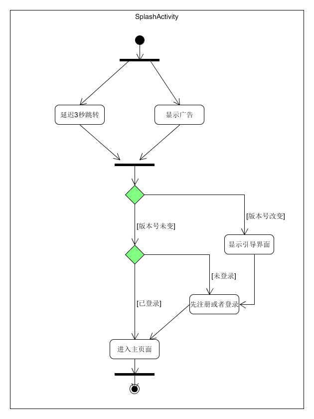

# 项目
>[project](https://github.com/IamLIFI/android/tree/master/RewriteMusic)

## Splash Activity界面思路
> 主要思路


延迟显示的方式：**使用handler发送信息， 根据3种情况跳转**
```java
//创建一个handler
private Handler mHandler = new Handler() {
        public void handleMessage(Message msg) {
            switch (msg.what) {
                case MSG_GUIDE:
                    startActivityAfterFinishThis(GuideActivity.class);
                    break;
                case MSG_HOME:
                    startActivityAfterFinishThis(MainActivity.class);
                    break;
                case MSG_LOGIN:
                    startActivityAfterFinishThis(LoginActivity.class);
                    break;
            }
        }
    };
//然后初始化页面后延迟3秒跳转
@Override
    void initDatas() {
        super.initDatas();
        mHandler.postDelayed(new Runnable() {
            @Override
            public void run() {
                if (isShowGuide()) {
                    mHandler.sendEmptyMessage(MSG_GUIDE);
                } else if(sp.isLogin()){
                    mHandler.sendEmptyMessage(MSG_HOME);
                } else {
                    mHandler.sendEmptyMessage(MSG_LOGIN);
                }
            }
        }, DEFAULT_DELAY_TIME);
    }

```

## 在这个页面中使用到的类的包装
[BaseActivity](https://baidu.com)
[BaseCommonActivity](https://baidu.com)
[SharePreference](https://baidu.com)
[PackageUtil](https://baidu.com)
